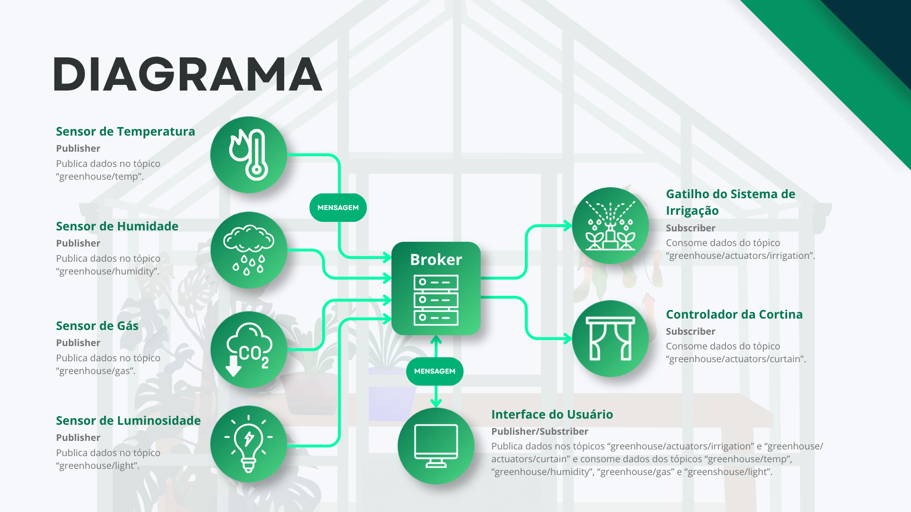
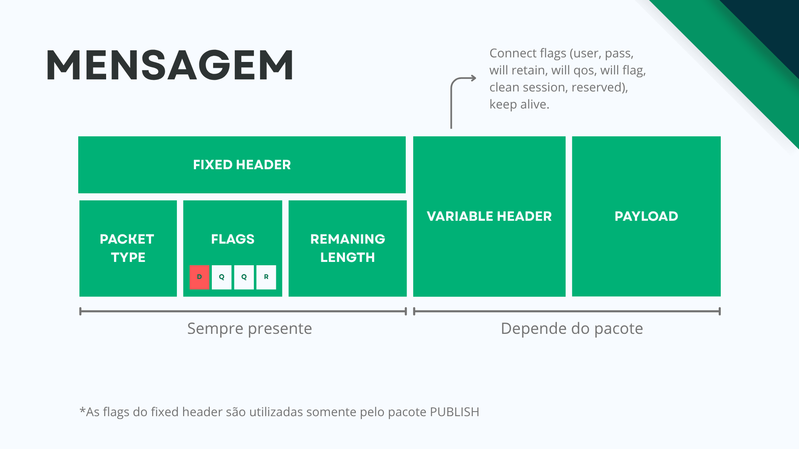

# Sistema de Monitoramento Inteligente para Estufas

Este projeto consiste num sistema de gestão inteligente para monitoramento de estufas de pequeno porte, focado na coleta de telemetria ambiental e controlo remoto de atuadores. O sistema utiliza uma arquitetura descentralizada baseada no protocolo **MQTT** sobre **TCP** para garantir a entrega de dados e o desacoplamento entre sensores e aplicações.

## 🚀 Funcionalidades

* **Monitoramento em Tempo Real**: Coleta de dados de sensores virtuais de temperatura, humidade, luminosidade e concentração de gás (CO2).
* **Controlo de Atuadores**: Interface para envio de comandos remotos para sistemas de irrigação e controladores de cortina.
* **Inteligência Ambiental**: Uso de uma máquina de inferência (rede neural simples com funções ReLU e Sigmoid) para calcular o índice de qualidade ambiental (*Life Chance*).
* **Dashboard Interativo**: Interface gráfica que permite visualizar os dados dos sensores e interagir com o painel de atuadores.

## 🏗️ Arquitetura do Sistema

O projeto fundamenta-se no modelo de **publicação-assinatura**:

1. **Broker**: Software central responsável por coletar mensagens, gerir subscrições e encaminhar dados aos destinatários corretos.
2. **Publishers (Sensores)**: Dispositivos virtuais que publicam dados em tópicos específicos, como `greenhouse/temp` ou `greenhouse/humidity`.
3. **Subscribers (Atuadores/Dashboard)**: Consomem dados dos tópicos de sensores ou comandos de controlo.

<figure>
  

    
  

  <figcaption align="center"><b>Figura 1:</b> Relação entre nós da rede.</figcaption>
</figure>

## 🛠️ Tecnologias Utilizadas

* **Linguagem**: Python.
* **Protocolo de Aplicação**: MQTT (implementação personalizada com suporte a pacotes binários como CONNECT, PUBLISH, SUBSCRIBE, PINGREQ, etc.).
* **Protocolo de Transporte**: TCP.
* **Formatos de Dados**: JSON para os payloads das mensagens.
* **Bibliotecas**: Tkinter (para a interface gráfica).

## 🔧 Decisões de Projeto

* **Leveza**: O protocolo MQTT foi escolhido pelo seu baixo *overhead* (cabeçalho fixo de apenas 2 bytes), ideal para redes com recursos limitados.
* **Confiabilidade**: Adoção do TCP para garantir o controlo de erros fim a fim.
* **Simplicidade**: Nesta fase de PoC, priorizou-se a agilidade, suprimindo temporariamente mecanismos complexos de autenticação e criptografia.

<figure>
  

    
  

  <figcaption align="center"><b>Figura 2:</b> Formato da Unidade de Dados do Protocolo.</figcaption>
</figure>

## 💻 Como Executar 

1.  Inicie o **Broker** para permitir a comunicação.
2.  Execute os **Sensores** (Publishers) para começar a enviar telemetria.
3.  Inicie o **Dashboard** para monitorar os dados e controlar os **Atuadores**.

---
*Este projeto foi desenvolvido como parte da disciplina TEC502-MI Concorrência e Conectividade na Universidade Estadual de Feira de Santana (UEFS)*.